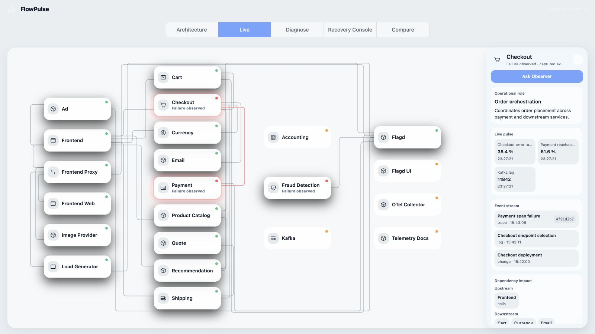
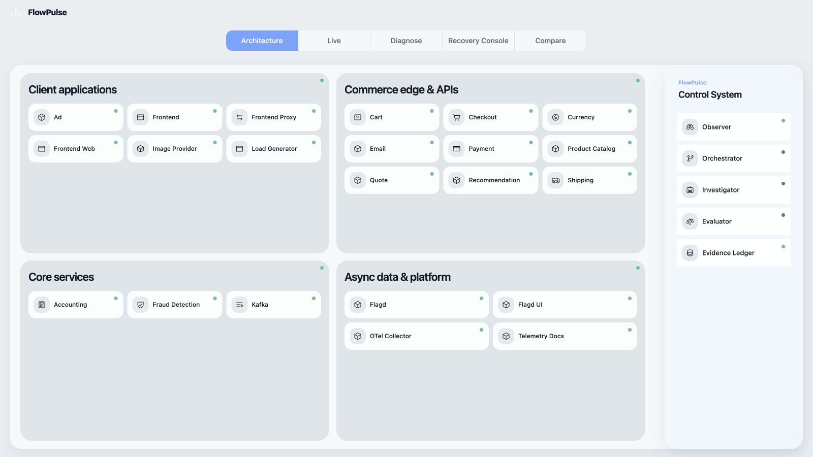
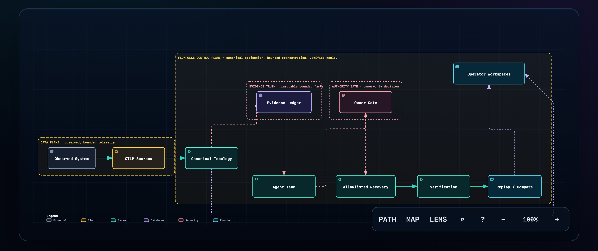

# FlowPulse

**FlowPulse is a model-agnostic, company-multiplayer agent operating system: easy enough for anyone to use, governed enough to act on real systems, and grounded in incident evidence.**

Incident response is FlowPulse's first vertical, not a second authority beside
the control plane. The browser and this repository's legacy Node demo consume
safe projections; the backend control plane owns the durable workflow and
evidence boundary. Temporal is the only workflow/state-transition authority,
Postgres holds append-only records and tenant-scoped read projections, and
object storage holds versioned raw artifacts. Models and agents can propose or
explain within typed activity boundaries, but they never become authority.

The V3 guided workspace keeps incident response interactive and stage-gated.

The additive Incident Workspace contract uses public
`(tenant_id, incident_id, run_id, topology_revision)` identities. Those are
backend-issued product identities, distinct from internal `case_id`, Temporal
`workflow_id`, and real `workflow_run_id`; a frontend must not derive a public
`run_id` from a Temporal string. See
[the control-plane workspace contract](docs/architecture/incident-workspace-control-plane-contract.md).

It is evidence-grounded by design: models and agents can explain, investigate, and propose, but current proof, human approval, and consequential state remain outside browser and model control. **Incident is the first vertical.** Architecture, Live, and Incident are the three product views; the V3 Incident workspace keeps the operator in one backend-gated flow through Detect, Triage, Investigate, Decide, Respond, and Verify.

<!-- north-star-guardrails-v2
{
  "schema_version": "flowpulse.north-star-guardrails.v2",
  "product_model_agnostic": true,
  "product_company_multiplayer": true,
  "incident_response_first_vertical": true,
  "top_level_navigation": ["Architecture", "Live", "Incident"],
  "stage_order": ["Detect", "Triage", "Investigate", "Decide", "Respond", "Verify"],
  "lifecycle_authority": "Temporal",
  "current_proof_authority": "Evidence Ledger",
  "knowledge_plane_role": "bounded_prior",
  "human_gates": ["Gate 1", "Gate 2"],
  "tenant_isolation": true,
  "provider_truth_labels": ["LOCAL CODEX", "OPENAI API", "RECORDED/DEMO"],
  "frontend_generated_prohibited": ["incidents", "agent_messages", "recommendations", "gates", "evidence", "actions", "verification", "success"],
  "dry_run_before_writes": true,
  "fastapi_temporal_control_plane": "v3_local_integrated",
  "node_compatibility_path": "compatibility_demo"
}
-->

FlowPulse turns bounded telemetry and change evidence into one inspectable operator workflow: detect the live fault, triage impact, investigate a causal claim, challenge it, decide on a bounded response, enforce owner approval, and verify fresh post-action data. The browser is a projection client. In the checked-in legacy compatibility/demo path, the append-only ledger and server-side policy record bounded local replay state and enforce local guardrails; they do not own incident lifecycle transitions. On the V3 local path, Temporal alone owns lifecycle transitions and pauses at every operator advance boundary.



## Why FlowPulse

Most incident tools show signals. FlowPulse keeps the decision trail that connects those signals to a safe response:

- **Evidence first.** Metrics, traces, logs, changes, topology, and citations are bounded before an agent can make a claim.
- **An adversarial evaluator.** A plausible diagnosis can be rejected and replanned when its causal evidence is incomplete.
- **Explicit authority.** Agents can investigate and propose; the owner gate and an allowlisted adapter control any consequential recovery.
- **Verified recovery.** A command succeeding is not enough. Fresh evidence and regression checks must establish recovery before the Incident workspace presents it as verified.

## North Star and current integration status

FlowPulse is designed for multiple teams, tenants, models, and registered tools without making any one provider or client the source of truth. The target control plane keeps **Temporal as the sole incident lifecycle authority**: agents propose, backend validators and registered tool adapters act, the Evidence Ledger records, and Temporal accepts lifecycle transitions. The browser is a strict projection client. Current incident proof must come from a canonical projection and recorded evidence lineage; Knowledge Plane material, runbooks, and historical examples are useful bounded priors, never proof for an action, gate, or verification.

The checked-in V3 local path now composes FastAPI, a Temporal workflow and worker, Postgres, MinIO, real Astronomy Shop OTLP input, and the Node process as a same-SHA BFF/internal bridge. FastAPI exposes the V3 projection and command contracts; Temporal remains the workflow authority; Postgres and MinIO keep durable state and evidence. This is a local, allowlisted integration—not a production rollout or production credential boundary.

The Node-owned deterministic replay, legacy Incident endpoints, and legacy Agent Team endpoints remain explicit **compatibility/demo** surfaces. They do not become lifecycle authority merely because the same Node process also proxies `/api/control-plane/v3/**` and hosts the V3 internal agent/action bridge. Provider truth labels remain independent of authority: `LOCAL CODEX`, `OPENAI API`, and `RECORDED/DEMO` identify the provider path rather than a lifecycle decision.

## Product tour

| Architecture | Live |
| --- | --- |
|  |  |
| A stable, line-free view of the observed system and the separate FlowPulse control system. | The canonical topology renders component status, safe details, and captured incident impact. |

From the same canonical run, the V3 **Incident** workspace carries the operator through **Detect → Triage → Investigate → Decide → Respond → Verify**. Only the current stage runs. The next stage remains locked until its predecessor succeeds and the operator sends an idempotent Next command; Respond also requires a separate receipt-bound approval. Completed stages remain available as immutable history.

## System architecture



The source diagram is available as [JSON](docs/architecture/flowpulse-signal-flow.architecture.json) and [SVG](docs/assets/flowpulse-signal-flow.svg).

```text
bounded telemetry + change evidence
        ↓
canonical topology + safe evidence projection
        ↓
advisory Agent Team ──→ evaluator ──→ owner gate
        ↓                                  ↓
append-only ledger ← verification ← allowlisted recovery
        ↓
Architecture · Live · Incident (Detect → Triage → Investigate → Decide → Respond → Verify)
```

## Run the V3 real-time guided workspace

The V3 local launcher starts the pinned Astronomy Shop, brings up the Node/BFF
internal bridge before the replacement Temporal worker, and builds FastAPI and
the worker from the same clean Git SHA. That order lets a persisted running
activity reconnect without exhausting its bounded retry.

Once the backend is readable, the launcher inspects the active V3 projection
and reads the real allowlisted `paymentUnreachable` flag before it creates or
resumes a case. With no active Astronomy incident it applies the fault only when
the flag is off, records a byte-and-time watermark, and requires a newer real
Checkout → Payment failure trace before incident intake. A pre-execution resume
requires the flag to remain on. A post-execution Verify resume requires the flag
to remain off and the Checkout runtime to match the immutable execution receipt;
drift fails closed and is never "fixed" by silently toggling the flag.

The launcher generates independent owner, execution-HMAC, and
safe-rollback-HMAC secrets in memory, reuses the existing Postgres/MinIO
volumes, and prints the case-bound `127.0.0.1:4173` URL only after the V3
projection contains the post-launch Checkout → Payment trace evidence, both
the trace and metrics connectors are current, and real error-rate, latency,
and request-count samples have arrived.

```bash
npm run v3:local:dry-run
npm run v3:local
```

The real start deliberately refuses a dirty worktree: otherwise the image
labels and Node source could claim a Git SHA they do not actually share. Stop
the foreground Node process with `Ctrl-C`; the Compose data volumes remain in
place. Pass `--new-case` to `node scripts/start-v3-local.mjs` when a fresh local
incident is desired.

## Run the compatibility/demo judge path

### Requirements

- macOS or Linux
- Node.js 20+
- `sqlite3` available on `PATH`

The default path is deterministic, credential-free, and does not require Docker, an OpenAI key, Langfuse, or a telemetry collector.

```bash
npm ci
npm run judge
```

`npm run judge` runs the automated suite and starts the local compatibility/demo server. On a fresh database, open [http://127.0.0.1:4310](http://127.0.0.1:4310), select **Incident**, then choose **Run guided replay**. That legacy Node-owned replay intentionally retains its four-step **Investigate → Decide → Execute → Verify** contract. The credential-free replay is recorded on the append-only ledger and uses bounded fixture, authority, repair, and independent verification contracts; it is not a browser-side success mock. It is separate from the V3 FastAPI/Temporal path and is not proof of production authority. The captured Astronomy Shop case shows a checkout change making payment unreachable, an evaluator rejecting an unsupported Kafka-root-cause claim, and a bounded checkout recovery evaluated through the owner-gate and verification projections.

For development, use separate commands:

```bash
npm test
npm start
```

## Truth boundary: replay versus local OTLP evidence

FlowPulse never labels captured evidence as live.

| Mode | What it proves | What it does not claim |
| --- | --- | --- |
| Deterministic replay | Full captured judge scenario, including the wider checkout, Kafka, accounting, and fraud causal story. | A production connection or live Kafka propagation. |
| Captured local OTLP | Bounded, provenance-preserving metric, trace, log, and change facts from a local source. | Unbounded raw telemetry or arbitrary database access. |
| Local development rehearsal | A narrowly scoped checkout-to-payment flag contrast with a code-owned allowlisted adapter. | Production deployment authority or the wider captured Kafka story. |

The UI only renders server-projected, redacted facts. Raw prompts, chain-of-thought, credentials, tokens, and raw telemetry payloads never belong in the browser.

## Optional full local evidence path

This disposable local path uses the pinned OpenTelemetry Astronomy Shop and Docker. It is not required for judging.

```bash
export FLOWPULSE_DEVELOPMENT_ENABLED=1
npm run live:check
npm run live:setup
npm run live:start
```

Use the local UI to follow the bounded development case, then stop the stack without deleting captures:

```bash
npm run live:stop
```

The allowed recovery is deliberately narrow: restore the known-good `paymentUnreachable` flag and recreate the local checkout container. No browser control, model output, or observability vendor can bypass the server policy or owner gate.

## Compatibility Agent Team and GPT-5.6

Codex was the primary engineering environment for FlowPulse: it helped design and implement the ledger-backed workflow, safe projections, frontend workspaces, tests, and browser QA during OpenAI Build Week.

GPT-5.6 is an optional product integration, not runtime authority. In credentialed mode it may query strictly allowlisted tools over a frozen OTLP snapshot, return a structured diagnosis and bounded repair proposal, and have that proposal challenged by an evaluator. The latest paid GPT-5.6 attempt failed closed before evaluator acceptance; it produced no accepted diagnosis, approval, repair, verification, or recovery. The deterministic replay is the reliable judge path.

The default recorded provider needs no credentials. `codex-local` requires an already authenticated local Codex CLI and is always surfaced as local advisory work rather than authority. The safe provider capability is available at `/api/agent-control/provider`. This legacy Node Agent Team remains a compatibility/demo surface alongside the narrower V3 internal agent bridge; it does not grant incident lifecycle authority.

## Safety model

- SQLite ledger events are append-only; starting a replay creates a new run rather than clearing history.
- The server validates evidence references, typed runtime transitions, evaluator outcomes, repair boundaries, and response-size caps.
- Agents can propose or explain. Only the server-side owner gate and allowlist can authorize a consequential local action.
- Verification and regression gates are independent of a model's narrative.
- A missing, stale, malformed, or insufficient source fails closed rather than silently falling back to invented data.

## Repository map

```text
public/                         Incident Digital Twin frontend
public/incident-workspace-v3.mjs  six-stage V3 operator workspace
src/server.mjs                  API and local static server
src/ledger.mjs                  append-only SQLite authority
src/runtime.mjs                 deterministic replay state machine
src/incident-projection.mjs     safe browser read model
src/live-source.mjs             bounded local OTLP source projection
src/agent-control-service.mjs   agent conversation and contextual workspaces
src/agent-team-harness.mjs      typed role and tool boundary
src/openai.mjs                  optional GPT-5.6 tools and evaluator loop
data/incidents/                 captured incident and regression evidence
test/                           contract, determinism, and API coverage
docs/submission/                owner-facing submission materials
control_plane/                  FastAPI, Temporal, Postgres, MinIO V3 control plane
```

## Competition materials

- [Demo action guide](docs/demo/openai-build-week-demo-action-guide.md)
- [Submission draft](docs/submission/devpost.md)
- [Submission checklist](docs/submission/submission-checklist.md)
- [Build Week checklist](docs/BUILD_WEEK_SUBMISSION_CHECKLIST.md)

The primary Build Week `/feedback` Session ID is `019f6eaf-ded3-78e1-a9c3-8ae4fd6811e2`. Later teammate session IDs are secondary provenance and do not replace this primary submission value unless the team documents that most core work moved elsewhere.

## Limitations

FlowPulse is a competition prototype with one captured judge incident and one local, reversible recovery boundary. It is not connected to production, Kubernetes, or an external deployment authority. A public video and final Devpost submission are external owner actions, not product claims.

## License

[MIT](LICENSE)
