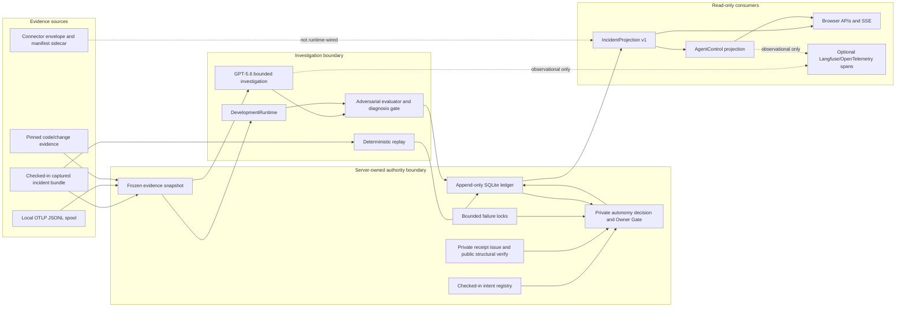
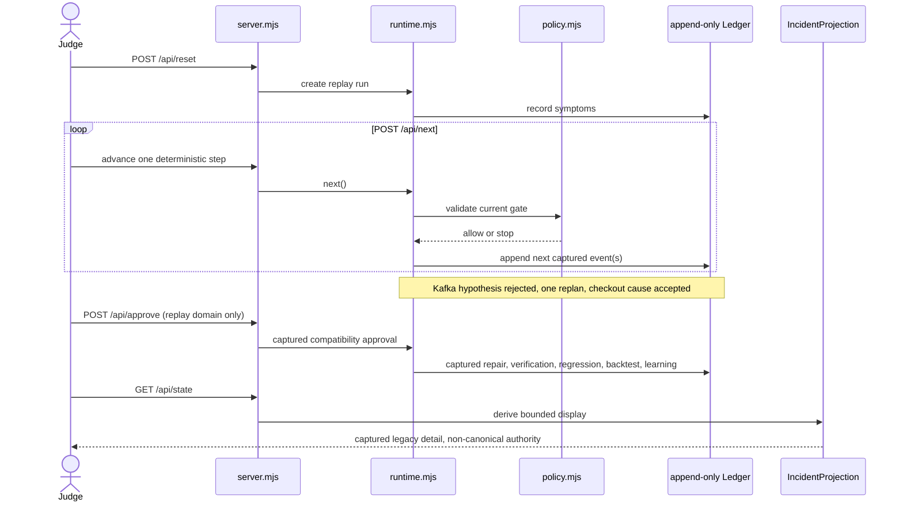
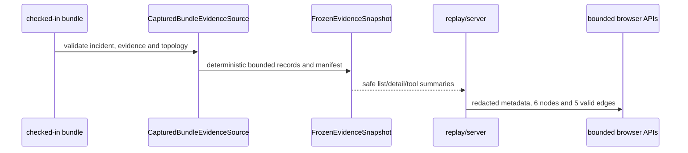
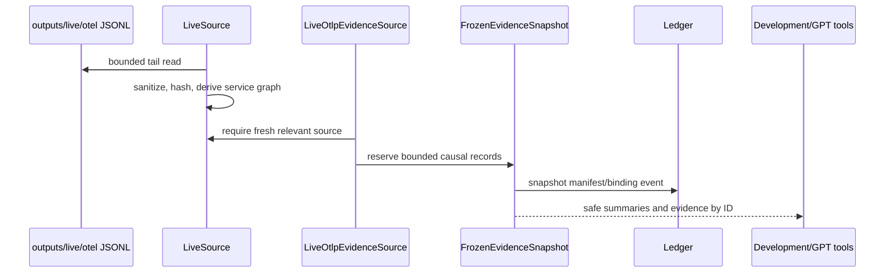
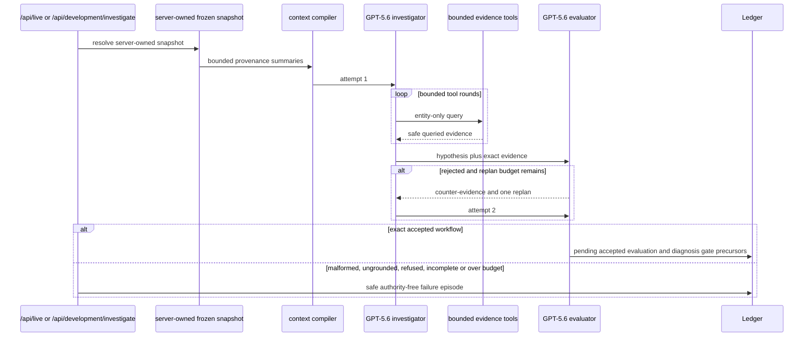
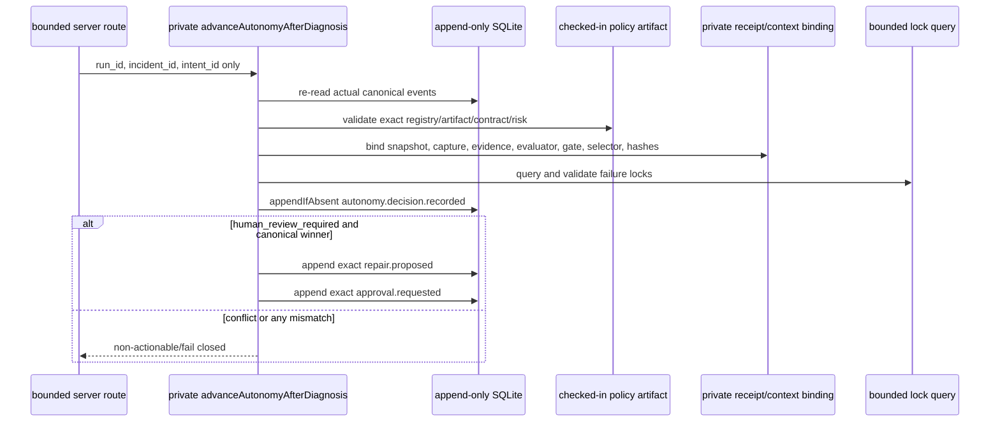
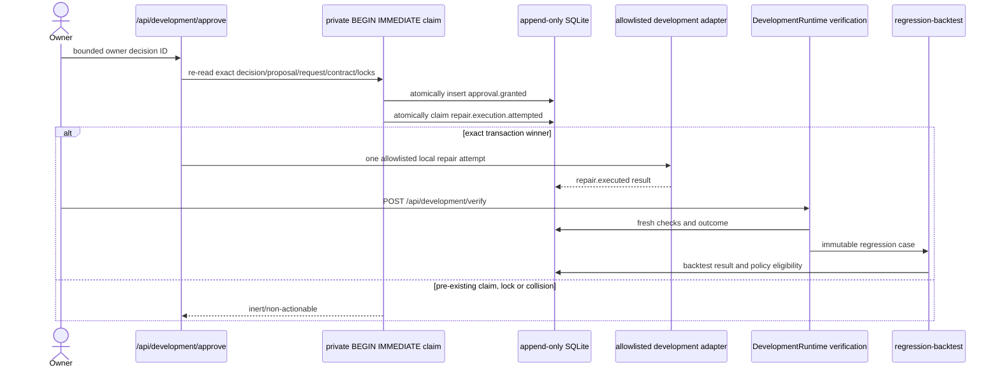
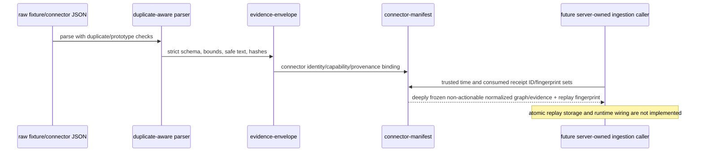
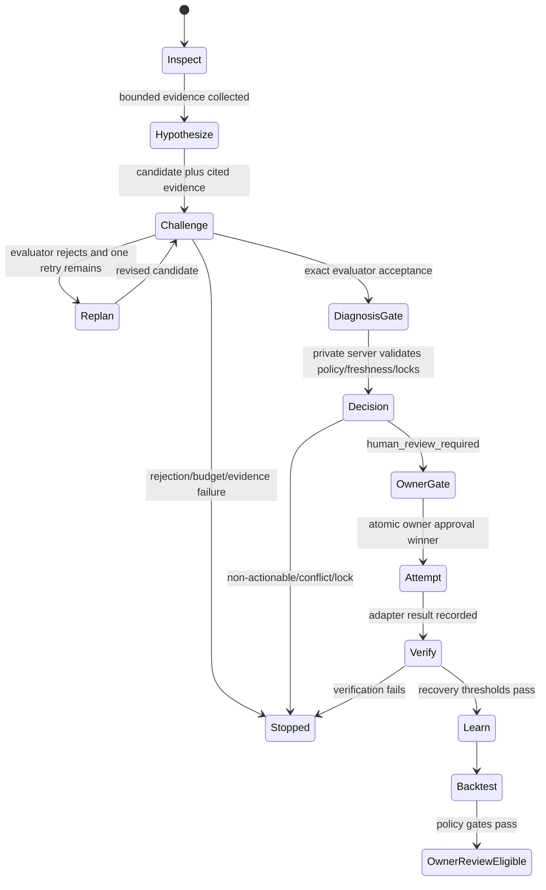

# FlowPulse backend capability audit

**Audit date:** 2026-07-19

**Audited branch:** `codex/topology-live-integration`

**Audited baseline:** `6633bbdbfb0da26bd2e2377c9e65599efcb869a2`

**Scope:** read-only backend, data-contract, runtime, test, and local-artifact audit. This document does not grant authority to the browser, fixtures, connectors, or models.

## Historical audit and compatibility status

This historical audit records the Node implementation at its audited baseline; it does not describe the approved agent-led Incident workspace as already delivered. The deterministic replay, compatibility browser surface, and legacy Agent Team remain compatibility/demo contracts until real FastAPI/Temporal control-plane equivalents provide the versioned incident projection, durable conversation, NextBestAction, human-gate, action, and event-stream contracts. They do not grant lifecycle authority, current-proof authority, or tenant authorization.

The approved North Star is model-agnostic and company-multiplayer: Incident is the first vertical, while Architecture and Live remain separate views. Temporal is the sole lifecycle authority; the Evidence Ledger records current proof, and Knowledge Plane material remains bounded prior context rather than evidence for a gate, action, or verification.

## Executive summary

FlowPulse has three materially different backend paths and they must not be presented as one capability:

1. A **credential-free deterministic judge replay** is complete and repeatable. It records symptoms, a deliberately wrong Kafka hypothesis, evaluator rejection, one replan, a bounded checkout diagnosis, an Owner Gate, captured repair and verification truth, regression, backtest, and learning events. The full test suite proves the logic; it is not a live production repair.
2. A **hardened local-development authority path** composes frozen evidence, evaluator and diagnosis gates, checked-in policy artifacts, freshness, failure locks, an atomic Owner Gate, one execution-attempt claim, verification, and backtest. Its production authority closure is private to `src/server.mjs`. Tests exercise concurrency and adversarial collisions. A QA record proves a real local deterministic Astronomy Shop recovery. No successful end-to-end GPT-5.6 recovery is currently proven.
3. A **model investigation path** can query a server-owned frozen OTLP snapshot through bounded tools and allows at most one evaluator-directed replan. It fails closed before authority on malformed, incomplete, ungrounded, or budget-exhausted output. A local paid-proof artifact records tool use followed by a safe malformed-output failure; it does not record accepted diagnosis, approval, or execution.

The strongest foundations are the append-only SQLite ledger, the private authority boundary, bounded evidence freezing, strict IncidentProjection v1, deterministic replay, and tested connector sidecar contracts. The biggest integration gaps are:

- the browser still receives both a compatibility state surface and IncidentProjection v1;
- `/api/source` currently omits the graph that `/api/state` projects for the same run;
- the checked-in judge bundle contains a bounded 6-node/5-edge incident graph, while the fuller 22-node/22-edge synthetic OTLP graph exists only in ignored local artifacts;
- the sanitized checked-in full-topology manifest described by the approved topology plan does not exist;
- connector contracts are not wired to runtime ingestion and receipt replay storage is not implemented;
- current local OTLP is stale, Langfuse has no credentialed runtime proof, and the latest paid GPT attempt failed closed before diagnosis.

The recommended first implementation checkpoint is therefore **only the sanitized full-topology evidence contract**: inventory the local synthetic OTLP component/dependency metadata, derive a checked-in bounded 22-node/22-edge manifest with provenance and deterministic ordering, test it, and stop for owner review. It must not change authority, connect to providers, or yet change the frontend.

## Evidence standard and status vocabulary

This audit uses code and direct runtime/test evidence ahead of README, specification, plan, or historical QA claims. The capability matrix uses only:

- `PROVEN_RUNNING_REAL`: directly observed against a real local component or local captured telemetry during this audit or an identified QA record, without claiming production deployment.
- `PROVEN_RUNNING_DETERMINISTIC`: directly exercised by a credential-free deterministic runtime/test.
- `IMPLEMENTED_TESTED_NOT_RUNTIME_PROVEN`: code and behavioral tests exist, but no corresponding configured runtime proof was observed.
- `IMPLEMENTED_UNTESTED`: implementation exists without sufficient direct or test evidence.
- `PLANNED_ONLY`: documented but not implemented.
- `MISSING`: required behavior or artifact is absent.

“Real” never means hosted production. It means the code interacted with an actual local dependency, local SQLite ledger, local OTLP spool, local checkout, or configured provider in the cited evidence.

## System context



### Planes and source-of-truth boundaries

| Plane | Current source of truth | May propose | May authorize |
|---|---|---|---|
| Evidence | checked-in bundle, bounded local OTLP capture, pinned code/change record, frozen snapshot | source adapter or connector contract | no |
| Investigation | deterministic runtime, DevelopmentRuntime, bounded GPT workflow | hypothesis, counter-evidence, diagnosis candidate | no |
| Evaluation | deterministic or model evaluator under exact evidence and harness contracts | rejection, acceptance, replan feedback | no |
| Authority | append-only ledger plus private server composition, checked-in policy, freshness, locks | canonical decision and Owner Gate records | yes, only inside the private server path |
| Execution | private server approval claim plus allowlisted development adapter | one bounded local repair attempt | only after exact canonical approval claim |
| Projection | IncidentProjection v1 derived from ledger and bounded source metadata | display state only | no |
| Browser | projection and compatibility read models | navigation, replay position, bounded owner request | no inference or minting |

## Module and component inventory

### Source modules

| Module | Purpose | Inputs | Outputs | Direct callers | Persistence / side effects | Authority level | Primary tests |
|---|---|---|---|---|---|---|---|
| `src/agent-control-service.mjs` | Projects and records the typed multi-agent control surface | ledger, IncidentProjection, safe manager messages/actions | 13-node/14-edge team projection, SSE-visible events, safe internal work records | `src/server.mjs` | appends bounded control events only | no remediation authority; consumes projection truth | `test/agent-control-service.test.mjs`, `test/server.test.mjs` |
| `src/agent-team-harness.mjs` | Defines role contracts, event prerequisites, budgets, idempotency, and collaboration boundaries | immutable role/task/event definitions and evidence references | validated proposed harness event | agent control and replay/control tests | none directly | proposal validation only | `test/agent-team-harness.test.mjs` |
| `src/autonomy-freshness.mjs` | Verifies bounded snapshot freshness receipts and exposes truth-neutral identity helpers | receipt plus expected snapshot/manifest/mode/time bounds | verified structural receipt or fail-closed error | private server authority composition; tests | none; issuance is deliberately not exported | verifier only | `test/autonomy-policy.test.mjs`, `test/server.test.mjs` |
| `src/autonomy-policy-artifacts.mjs` | Stores immutable, checked-in intent registry/artifacts and exact action/contract schema | code-owned artifact definitions | frozen registry and intent lookup | `src/server.mjs` | none | code-owned policy input; cannot decide alone | `test/autonomy-policy.test.mjs`, `test/server.test.mjs` |
| `src/autonomy-policy.mjs` | Evaluates deterministic risk/gate rules and builds authority-neutral decision material | selector, artifact, evaluation, evidence, freshness, lock state | bounded decision classification or non-actionable result | `src/server.mjs`, projection validation | none | evaluator; public exports cannot issue authority | `test/autonomy-policy.test.mjs`, `test/server.test.mjs` |
| `src/bundle.mjs` | Loads and validates the checked-in Astronomy checkout captured bundle | `data/incidents/astronomy-checkout.json` | normalized incident, evidence, 6-node/5-edge topology | runtime, server, evidence source, tests | file read only | evidence, never authority | `test/runtime.test.mjs`, `test/evidence-source.test.mjs`, `test/server.test.mjs` |
| `src/code-evidence.mjs` | Produces bounded semantics from the exact pinned repository object and allowlisted change | pinned commit/file/range/hash and change manifest | hashed code/change evidence without raw source contents | development adapter/runtime, incident mechanism | local git reads | evidence only | `test/code-evidence.test.mjs`, `test/development-runtime.test.mjs` |
| `src/connector-manifest.mjs` | Strict provider-neutral read-only connector manifest, receipt, replay, health, and capability validation | duplicate-safe manifest/envelope parse proof, trusted time, replay guard | normalized non-actionable graph/evidence sidecar plus replay fingerprint | tests only | none; atomic replay persistence delegated to a future caller | no authority; action/write/remediation forbidden | `test/integration-contract.test.mjs` |
| `src/context-compiler.mjs` | Compiles bounded evidence summaries for model attempts | frozen snapshot records and queried evidence IDs | deterministic provenance-preserving context | `src/openai.mjs` | none | explicitly non-authoritative | `test/context-compiler.test.mjs` |
| `src/development-adapter.mjs` | Encapsulates allowlisted local Astronomy Shop setup, change, capture, repair, and verification reads | environment enable flag, pinned checkout, code-owned case/command | local Docker/flagd operations and hashed capture manifest | `src/server.mjs`, `src/development-runtime.mjs` | clones/checks out local repo, may run Docker and mutate local flag only when enabled | execution adapter; no public approval surface | `test/development-adapter.test.mjs`, `test/server.test.mjs` |
| `src/development-runtime.mjs` | Runs local baseline/case collection, deterministic diagnosis gate, verification, learning and backtest; investigation stops before authority | adapter, ledger, frozen source, code-owned case | investigation precursor events; post-execution verification records | `src/server.mjs` | appends through supplied ledger; local adapter calls | investigation/verification only; exposes no approve/execute | `test/development-runtime.test.mjs`, `test/server.test.mjs` |
| `src/evidence-envelope.mjs` | Duplicate-aware strict JSON parser, bounded evidence envelope validation, canonicalization, unsafe-content rejection | raw JSON plus schema/bound/context proofs | deep-frozen safe normalized entities, relations, evidence and hashes | connector manifest and tests | none | evidence sidecar only | `test/integration-contract.test.mjs` |
| `src/evidence-source.mjs` | Implements captured-bundle and local-OTLP evidence sources, freezing, safe list/detail, and immutable snapshot | bundle or `LiveSource`, incident scope, capture bounds | `FrozenEvidenceSnapshot`, bounded browser/model summaries and details | server, DevelopmentRuntime, regression backtest | reads source; snapshot held in memory and manifested to ledger | evidence only | `test/evidence-source.test.mjs`, `test/development-runtime.test.mjs`, `test/server.test.mjs` |
| `src/harness-manifest.mjs` | Binds model, skill docs, protocols, limits, and versions into an immutable harness hash | checked-in harness files and model policy | manifest and deterministic hash | server, openai, development runtime/backtest | file reads only | configuration integrity, not authority | `test/harness-manifest.test.mjs`, `test/openai-contract.test.mjs` |
| `src/incident-mechanism.mjs` | Validates checkout/payment causal mechanism and evidence ordering | change, code, trace/failure, hypothesis/evaluator evidence | bounded causal-gate decision | evidence, development, GPT and backtest paths | none | diagnosis gate input, not approval | `test/evidence-source.test.mjs`, `test/development-runtime.test.mjs`, `test/openai-contract.test.mjs` |
| `src/incident-projection.mjs` | Builds bounded, deterministic, revisioned IncidentProjection v1 from canonical ledger and source state | scoped events, graph, evidence, truth axes, optional canonical authority chain/cursor | browser-safe incident summary, graph, frames, investigation, decision/gate/action/verification state | `src/server.mjs` | none | read-only; cannot strengthen canonical authority | `test/incident-projection.test.mjs`, `test/server.test.mjs` |
| `src/investigation-failure.mjs` | Classifies and records safe exactly-once model failure metadata | provider/response failure type and safe identifiers | authority-free failure episode | server and OpenAI failure paths | appends safe event through ledger | no authority | `test/investigation-failure.test.mjs`, `test/openai-contract.test.mjs` |
| `src/ledger.mjs` | SQLite append-only event store and bounded indexed queries | event append/list/get parameters | immutable events, idempotent winner, type-scoped lock query | server and all runtimes/tests | SQLite file; UPDATE/DELETE triggers abort; indexed append-only history | canonical runtime truth store, not a policy issuer | `test/ledger.test.mjs`, `test/server.test.mjs`, runtime/control tests |
| `src/live-source.mjs` | Reads bounded local OTLP JSONL tails, sanitizes them, and derives service/dependency topology | trace/metric/log spool directory and freshness clock | source status, bounded evidence metadata, nodes/edges, hashes | server through live evidence source | local file reads only | source evidence only | `test/live-source.test.mjs`, `test/evidence-source.test.mjs` |
| `src/load-env.mjs` | Loads local environment configuration without replacing existing variables | `.env`-style file | process environment values | `src/server.mjs` | local file read and process env assignment | configuration only | exercised indirectly by server tests |
| `src/observability.mjs` | Optional Langfuse/OpenTelemetry tracing wrapper | Langfuse credentials, trace/generation/tool/evaluator metadata | spans or no-op recorder | server and OpenAI workflow | optional network export when configured | observational only | indirect server/OpenAI tests; no credentialed trace proof |
| `src/openai-response.mjs` | Validates transport, terminal response, structured output, tool calls, reasoning replay, and budgets | Responses API result and strict schema/budget | safe validated model/evaluator result or typed fail-closed error | `src/openai.mjs` | none | response boundary, not authority | `test/openai-response.test.mjs`, `test/openai-contract.test.mjs` |
| `src/openai.mjs` | Runs bounded GPT-5.6 investigator/evaluator with frozen evidence tools and one replan | API key, frozen snapshot, ledger, harness/context, model transport | queried-evidence hypothesis/evaluation/gate precursor events or safe failure | `src/server.mjs` | provider calls when explicitly configured; appends only validated precursor/failure events | model proposes; cannot approve or execute | `test/openai-contract.test.mjs`, `test/openai-response.test.mjs`, `test/gpt-development-integration.test.mjs` |
| `src/policy.mjs` | Legacy deterministic replay gate checks | replay event stream | captured replay decision/eligibility | `src/runtime.mjs` | none | replay-only policy, not hardened development authority | `test/runtime.test.mjs` |
| `src/projection-canonical-validator.mjs` | Strict event-specific browser-chain validator | scoped ledger events and bounded evidence | canonical evaluator/gate/Owner/execution/verification chain or fail-closed status | IncidentProjection and server projection path | none | read-only authority interpretation | `test/incident-projection.test.mjs`, `test/server.test.mjs` |
| `src/regression-backtest.mjs` | Builds versioned regression artifacts, validates recovery receipts, runs offline backtest, and computes promotion policy | evidence bindings, recovery checks, seed/version/harness | regression case, backtest result, policy eligibility | development runtime, server/OpenAI evidence paths | event/artifact records through ledger | recommends eligibility; does not self-promote | `test/development-runtime.test.mjs`, `test/server.test.mjs` |
| `src/runtime.mjs` | Nine-step deterministic judge replay and captured compatibility approval/verification path | ledger, captured bundle, replay command | replay events, state and compatibility captured outcomes | `src/server.mjs`, runtime tests | append-only ledger events | deterministic demo only; legacy authority rows are non-canonical in IncidentProjection | `test/runtime.test.mjs`, `test/server.test.mjs` |
| `src/server.mjs` | Unique HTTP/static composition root; owns ledger, sources, private authority closure, private Owner Gate/execution claim, projection and APIs | environment, HTTP requests, checked-in artifacts, local sources | HTTP/SSE responses and canonical ledger events | process entry point | SQLite, optional provider/observability/local adapter operations | only production authority composition root | `test/server.test.mjs` plus nearly all focused backend suites |
| `src/telemetry-sanitizer.mjs` | Removes secret-bearing identifiers and bounds OTLP facts before use | raw local OTLP-derived objects | safe normalized facts/hashes | live and evidence sources | none | redaction boundary only | `test/live-source.test.mjs`, `test/evidence-source.test.mjs` |

### Scripts, checked-in data, and fixtures

| Path | Purpose | Input/output | Mutation profile | Evidence status |
|---|---|---|---|---|
| `scripts/live-demo.mjs` | Dispatches `check`, `setup`, `start`, `case`, and `stop` commands for local Astronomy Shop | environment and local checkout; emits CLI summaries | setup/start/case/stop may clone, run Docker, or mutate local flagd | implemented and tested indirectly; not invoked in this audit |
| `scripts/submission-check.mjs` | Checks required submission files, tracked forbidden artifacts/secrets, then runs tests | repository tree | test subprocess only | implemented; not needed for capability claims here |
| `data/incidents/astronomy-checkout.json` | Credential-free deterministic incident bundle | 12 evidence records, 6 nodes, 5 directed edges | immutable checked-in fixture | direct parse and tests prove deterministic replay |
| `test/fixtures/integration/lineage-v1.json` | Synthetic captured workflow lineage fixture | 5 entities, 3 relations, 2 evidence records | test-only, immutable | integration-contract tests |
| `test/fixtures/integration/stream-warehouse-v1.json` | Synthetic captured stream/warehouse fixture | 6 entities, 5 relations, 2 evidence records | test-only, immutable | integration-contract tests |
| `integrations/` checked-in manifests and pins | Pinned local demo setup, change/case and bounded code semantics | code-owned local-development configuration | local adapter reads; no browser control | development adapter/runtime tests |
| `agents/` and `evals/` checked-in files | Immutable role skills/protocols and regression/evaluation inputs | hash-bound by harness/backtest | read-only configuration | manifest and development tests |

## End-to-end paths

### Deterministic judge replay



Observed status: `PROVEN_RUNNING_DETERMINISTIC`. The replay is the default judge path. It proves the product narrative and gate ordering, not production remediation.

### Captured evidence ingestion



The bundle is checked in and deterministic. It is labelled captured/deterministic, never live production telemetry.

### Local OTLP source and freeze path



`LiveSource` caps each local input file and each tail. Freezing rejects stale/irrelevant input and reserves baseline, code, change, and three distinct failures for the executable path. During this audit the local ignored spool contained 22 nodes/22 valid edges but its latest observation was stale. Raw OTLP remains local and excluded from browser/model contexts.

### GPT-5.6 investigation, evaluator, and one replan



The current model policy limits evidence context, tool rounds, tool calls, paid responses, and output tokens. `store:false` is used and encrypted reasoning replay stays in memory. The latest audited local paid-proof database ended in `development.investigation.failed` after tool events; it did not reach accepted diagnosis or Owner Gate.

### Private autonomy decision and Owner Gate



The closure and receipt issuer are not exported. Investigators end at a verified diagnosis gate. The route cannot supply truth, policy, risk, contract, clock, snapshot, receipt, evaluator, evidence, or lock values.

### Approval, development execution, verification, learning, and backtest



The implementation promises at most one local adapter attempt, not exactly-once external effect. A crash after an external side effect and before the corresponding ledger result requires verification/reconciliation; there is no automatic replay.

### Observability path

```mermaid
sequenceDiagram
  participant Server
  participant Workflow as control/model workflow
  participant Obs as observability.mjs
  participant LF as Langfuse via OpenTelemetry

  Server->>Obs: initialize only with public and secret keys
  alt configured
    Workflow->>Obs: safe trace/generation/tool/evaluator metadata
    Obs->>LF: export spans
  else unconfigured or initialization failure
    Obs-->>Workflow: no-op; runtime continues
  end
```

Langfuse is observational and never an authority input. This audit's health response reported `langfuse:false`; no credentialed trace was generated.

### Connector manifest and evidence-envelope path



### IncidentProjection and browser path

```mermaid
sequenceDiagram
  participant Browser
  participant Server
  participant Ledger
  participant Validator as canonical validator
  participant Projection as IncidentProjection v1

  Browser->>Server: GET /api/state or /api/agent-control
  Server->>Ledger: preflight count/UTF-8 bytes, then scoped read
  Server->>Validator: validate order, scope, payload, evidence, relationships
  Validator-->>Projection: canonical chain or fail-closed state
  Projection->>Projection: cap graph, evidence, frames and output; bind revision/cursor
  Projection-->>Browser: redacted bounded read model
```

The browser may consume stage, risk, evaluator, gate, action, verification, and why-stopped only from this projection. Cursor, local timers, mock state, and replay controls have no authority.

## HTTP and SSE endpoint catalog

All endpoints are composed in `src/server.mjs`. Browser responses receive CSP, no-sniff, frame denial, and no-referrer headers. Unknown non-GET routes return 404. Generic errors expose bounded safe messages rather than raw provider/telemetry payloads.

| Method | Path | Request contract | Response | Side effects / authority | Source modes and fail-closed behavior | Current frontend consumer |
|---|---|---|---|---|---|---|
| `OPTIONS` | any | none | `204` | none | CORS/preflight only | browser transport |
| `GET` | `/api/health` | none | `{ok, ledger, agent_control, langfuse, source}` | none | reports disconnected/stale without upgrading | health/judge check |
| `GET` | `/api/state?projection_cursor=` | bounded opaque cursor | browser-state v1 compatibility fields plus `incident_projection` | read-only; ledger preflight before materialization | malformed/oversize/cursor mismatch becomes bounded non-actionable | restored frontend primary state endpoint |
| `GET` | `/api/source` | none | redacted source metadata/topology | read-only | current implementation returns an empty graph because the route does not pass IncidentProjection into the redactor | source views; contract gap |
| `GET` | `/api/evidence?run_id=&cursor=&limit=&kind=&entity=` | bounded filters; limit capped | source metadata and paged safe evidence summaries | read-only | unknown/stale/malformed source is bounded; raw payload excluded | evidence list/drawer |
| `GET` | `/api/evidence/:id?run_id=` | bounded path ID/run | safe evidence detail or 404 | read-only | no raw OTLP/log body/provider payload | evidence drawer |
| `GET` | `/api/agent-control` | none | bounded team graph, role states, safe actions and IncidentProjection-derived authority-visible state | read-only | cannot strengthen projection; unavailable remains unavailable | recovery/agent UI |
| `GET` | `/api/agent-control/events` | SSE connection | initial state, updates and heartbeat | keeps a polling timer/socket only | connection closes cleanly; no mutation or durable stream authority | live agent-control UI |
| `POST` | `/api/agent-control/message` | exact bounded `{message, collaborator_id}` | recorded manager request/response | appends safe control events; optional observational trace | no approval/execution; invalid collaborator/input fails | manager chat |
| `POST` | `/api/agent-control/action` | bounded `{action,input}` | safe work result or deterministic advance | may append internal control/replay events; external mutation remains false for safe items | owner-gated/external actions are not granted by this route | agent control actions |
| `GET` | `/api/development/status` | none | bounded local adapter/runtime status | read-only | disabled/unconfigured reported honestly | development console |
| `POST` | `/api/development/setup` | code-owned configuration only | local setup status | may clone/fetch/checkout local demo | gated by development enablement; failure returns no authority | operator-only development UI |
| `POST` | `/api/development/start` | code-owned case | run/start status | reads baseline, starts local stack/capture, applies local change | fails before change if baseline/pin is absent | operator-only development UI |
| `POST` | `/api/development/case` | bounded code-owned case selector | case application status | mutates only allowlisted local flag/case | no request-supplied repair/contract | operator-only development UI |
| `POST` | `/api/development/investigate` | absent body or exact empty JSON only | investigation/decision/Owner-Gate result | runs deterministic or GPT investigation, then private server authority closure | any caller authority field returns conflict; single-flight; stale/malformed evidence fails | development investigation UI |
| `POST` | `/api/development/approve` | JSON containing only a bounded explicit owner value; run, incident, intent, decision and contract are server-resolved | canonical approval/execution attempt/result | `BEGIN IMMEDIATE` validates exact chain and locks, claims one approval/attempt, may invoke one allowlisted local adapter | pre-existing/colliding claim inert; touching lock blocks; no override | future D.1 owner action; current restored UI must not infer |
| `POST` | `/api/development/verify` | JSON required; current run is server-resolved and request fields are not authority inputs | recovery checks, outcome, regression/backtest/policy | reads current local flag/OTLP and appends verification/learning records | requires executed canonical attempt and fresh evidence | development verification UI |
| `POST` | `/api/reset` | none | new replay state | appends deterministic replay start | replay domain only | judge replay controls |
| `POST` | `/api/next` | none | advanced replay state | appends one deterministic step | gate failures stop; cannot grant development authority | judge replay controls |
| `POST` | `/api/approve` | replay compatibility approval input | replay state | appends captured compatibility approval only | rejects development runs with 409; never invokes private development adapter | legacy replay UI |
| `POST` | `/api/live` | no request-derived authority or evidence input; source and run are server-resolved | model-only run result or safe failure | freezes source and may call GPT if configured | source/key/response failures append authority-free failure; not local real repair | legacy/model-only UI |
| `GET` | static path / `/` | allowlisted public file path | HTML/CSS/JS/assets | file read only | traversal and unknown asset fail | browser application |

### Direct API observation on 2026-07-19

A temporary credential-free server used a unique port, an empty OTLP directory, and a temporary SQLite database; it was terminated after inspection.

| Request | Result |
|---|---|
| `GET /api/health` | HTTP 200; append-only SQLite, ledger-governed agent control, Langfuse disabled, source disconnected |
| `GET /api/state` | HTTP 200; 2 replay events; source topology 6 nodes/5 edges; IncidentProjection `monitor/collecting`; agent graph 13/14 |
| `GET /api/source` | HTTP 200; 0 nodes/0 edges despite the same selected replay source exposing 6/5 through `/api/state` |
| `GET /api/agent-control` | HTTP 200; 13 nodes/14 edges; only safe `summarize` action visible |
| `GET /api/evidence?limit=3` | HTTP 200; 3 of 12 safe summaries, explicitly truncated, no raw payload |
| `POST /api/development/investigate` with injected authority fields | HTTP 409; caller authority input rejected |

## Data sources and persistence catalog

### Available data sources

| Source | Location | Availability | Contents observed | Truth label | Runtime use |
|---|---|---|---|---|---|
| Astronomy checkout incident bundle | `data/incidents/astronomy-checkout.json` | checked in | 12 evidence, 6 nodes, 5 edges | captured fixture / deterministic replay | default judge replay and captured source |
| Full synthetic OTLP spool | ignored `outputs/live/otel/` | local-only/generated | bounded tails: 377 traces, 42 metrics, 500 logs; derived 22 nodes/22 valid edges | currently stale local OTLP; never claim live | `LiveSource` when configured by `FLOWPULSE_OTLP_DIR` |
| Frozen OTLP capture manifests | ignored `outputs/live/captures/` | local-only/generated | three bounded manifests observed; counts/hashes only audited | frozen real snapshot provenance | local development/model evidence |
| Lineage integration fixture | `test/fixtures/integration/lineage-v1.json` | checked in, test-only | 5 entities, 3 relations, 2 evidence | captured fixture, current health unavailable | C.1 contract proof only |
| Stream/warehouse fixture | `test/fixtures/integration/stream-warehouse-v1.json` | checked in, test-only | 6 entities, 5 relations, 2 evidence | captured fixture, current health unavailable | C.1 contract proof only |
| Pinned code/change evidence | `integrations/`, local pinned checkout, `src/code-evidence.mjs` | manifests checked in; checkout generated | bounded semantic facts and exact hashes, no source body in model/browser projection | real local development when pin matches | development causal gate |
| Connector capability snapshot | untracked `state/connector_capabilities.json` | generated/local-only | bounded generated capability summary; 5,523 bytes at audit | generated evidence, not authority | not wired to runtime |
| Paid GPT proof ledger | ignored local SQLite under `outputs/live/` | local-only/generated | 2 runs/19 events; one development run reached tool calls then failed malformed output | GPT model-only failure proof | audit evidence only |
| Sanitized full topology manifest | planned `data/topology/otel-demo-system-v1.json` | absent | intended 22 nodes/22 edges plus provenance | captured fixture or fresh source depending provider | planned P0 topology composition |
| Production vendor connectors | absent | unavailable | none | unavailable | not implemented |

No raw OTLP rows, environment contents, credentials, prompts, or provider response bodies are copied into this document.

### Ledger and generated state

`src/ledger.mjs` creates one SQLite `events` table with an autoincrement sequence, unique event ID, run/incident IDs, timestamp/offset, type/actor, JSON payload, ordered evidence references, parent, and correlation. Indexes cover run/sequence, incident/sequence, and type/sequence. UPDATE and DELETE triggers abort, making the table append-only through both the module and direct SQL. `appendIfAbsent` gives an immutable idempotent winner; callers must compare a pre-existing event for complete equivalence before treating `inserted:false` as success.

The autonomy lock query is global and type-indexed, capped at 512 rows, and throws on overflow. The server validates lock schema and relevance and converts errors to non-actionable behavior.

| State/artifact | Default or observed path | Lifecycle | Git policy |
|---|---|---|---|
| canonical ledger | `.flowpulse/ledger.db` or test/configured path | persistent append-only SQLite | ignored |
| run IDs | generated per replay/development/model run | stored in event headers and bindings | inside ledger only |
| frozen snapshots | in-memory object plus snapshot/manifest binding events | server process lifetime; content hashes in ledger | raw contents not committed |
| freshness receipts | private server issuance plus structural verifier and private context map | short-lived, server-process-bound | not persisted as public mint material |
| local OTLP | `outputs/live/otel/*.jsonl` | generated spool | ignored |
| local captures | `outputs/live/captures/` | generated hashed manifests | ignored |
| local demo checkout | `outputs/live/opentelemetry-demo/` | generated pinned checkout | ignored |
| regression/backtest records | ledger events plus versioned code-owned seed/artifact definitions | append-only | definitions checked in, results generated |
| connector receipt replay set | future caller-owned atomic storage | not implemented | none |
| generated connector snapshot | `state/connector_capabilities.json` | local generated artifact | currently untracked; must remain out of this commit |

### Integrity and exclusion rules

- Raw OTLP is read locally, bounded, sanitized, summarized, and hashed. It is not returned to the browser or pasted into model prompts.
- Secret-bearing environment files, local checkouts, logs, SQLite databases, and `outputs/` are ignored.
- Checked-in fixtures use synthetic safe values and strict unsafe-content validation.
- Browser endpoints return safe projections and bounded strings, not raw ledger payloads.
- Snapshot/receipt/decision identities bind hashes and exact scope; a new receipt cannot refresh stale capture evidence.

## Agent loop and harness

### Roles and separation

The checked-in harness defines these roles:

| Role | Trigger / input | May emit | Important prohibitions |
|---|---|---|---|
| Monitor | run/source change | monitoring and source-health observations | no diagnosis or repair authority |
| Evidence | evidence collection request | bounded evidence references/summaries | no hypothesis acceptance |
| Diagnosis | sufficient referenced evidence | hypothesis and diagnosis candidate | no owner approval/execution |
| Adversarial evaluator | diagnosis candidate plus exact evidence | rejection/acceptance and counter-evidence | no remediation planning or execution |
| Remediation planner | accepted diagnosis/decision | bounded proposed repair contract | no approval or adapter call |
| Verification | canonical execution result plus fresh source | before/after checks and outcome | no self-promotion |
| Evolve | verified recovery and regression inputs | learning/regression proposal | cannot mark tests passed |
| Test | immutable regression artifact | backtest result | cannot mutate source/production |

`AgentControlService` exposes a 13-node/14-edge UI/team projection that includes manager/collaborator boundaries around those roles. Manager messages and safe internal work are append-only and cited. External mutation is false unless the separate canonical Owner Gate path is used.

### Loop states



### Triggers, feedback, budgets, and stop conditions

- Deterministic replay advances only on `/api/next` or bounded safe agent-control advance.
- Development investigation requires a fresh server-owned snapshot, exact baseline/change/code semantics, and three distinct bounded failures.
- GPT investigation uses only evidence IDs returned in the same attempt. The evaluator's accepted hypothesis must match the diagnosis hypothesis.
- One evaluator rejection may trigger one replan. Further rejection, malformed output, missing queried evidence, token/response budget exhaustion, refusal, incomplete response, or transport error stops authority progression.
- The model workflow is capped at four tool rounds, 24 calls, 10 paid responses, and configured output-token/context limits. Only encrypted reasoning replay is retained in memory; no chain-of-thought is projected.
- Decision stops on stale/future/misordered capture, unknown source mode, registry/contract drift, evidence hash mismatch, duplicate/conflicting claims, lock query overflow/error, or active relevant failure lock.
- Owner approval stops on any canonical chain mismatch or lock observed before or at the atomic claim boundary.
- Verification stops without the exact executed attempt, fresh source evidence, and three recovery checks.
- Promotion is never automatic: passing backtest yields `eligible_for_owner_review` only.

### Deterministic versus model-generated

| Behavior | Deterministic | Model-generated |
|---|---:|---:|
| default judge event sequence | yes | no |
| wrong Kafka hypothesis and its rejection in judge replay | yes | no |
| local DevelopmentRuntime causal investigation when no provider key is used | yes | no |
| GPT investigator hypotheses/tool selection | no | yes |
| GPT evaluator rejection/acceptance | no | yes |
| policy/freshness/lock/contract validation | yes | no |
| canonical decision and Owner Gate derivation | yes, server-owned | no |
| local adapter target and command | yes, allowlisted | no |
| verification thresholds and backtest result | yes | no |

## Eval, evolve, validation, and backtest

### Current code paths

1. `incident-mechanism.mjs` validates causal membership and ordering for checkout/payment evidence, including flag consumption, failure traces, source mode and hypothesis/evaluator identity.
2. `policy.mjs` validates the deterministic captured replay's rejection, cause, Owner Gate, recovery, regression and learning sequence.
3. `autonomy-policy.mjs` plus checked-in artifacts validate the hardened development decision contract, canonical risk and action classification.
4. `regression-backtest.mjs` binds a versioned seed, exact evidence/recovery receipt, harness/artifact versions and policy gates; it runs an offline executed backtest.
5. `DevelopmentRuntime.verify()` records recovery checks, an outcome, a regression case, a backtest result and a policy result after the canonical local execution path.
6. Evolve/Test harness roles separate learning proposal from test execution.

### Datasets and artifacts

| Item | Current form | Status |
|---|---|---|
| checkout incident | checked-in 12-record captured bundle | deterministic replay dataset |
| local checkout flag regression | checked-in case/pin plus local generated OTLP | real local development case |
| regression seed/artifact schema | versioned code-owned definitions | tested |
| integration lineage/stream fixtures | two checked-in synthetic fixtures | contract-only; not runtime eval cases |
| broader incident corpus | absent | missing |
| historical production outcomes | absent | missing |

### Scoring, gates, promotion, and rollback

- The evaluator is pass/reject with counter-evidence rather than a broad scalar leaderboard.
- Recovery is threshold-based and requires three fresh checks.
- Backtest recomputes bindings; artifact, receipt, evidence or harness drift fails closed.
- A passing backtest only produces eligibility for owner review. There is no automatic deployment/promotion.
- The only implemented rollback/repair target is the code-owned local checkout flag contract. The same server-owned Owner Gate is required.

### Missing eval depth

- no multi-incident production-like evaluation corpus;
- no provider-model comparison or calibrated evaluator precision/recall report;
- no successful current GPT diagnosis-to-verified-recovery artifact;
- no continuous CI promotion workflow;
- no production rollback or verification connector;
- no long-term regression trend store beyond ledger events/local artifacts.

## Authority and threat boundaries

| Actor/source | May supply or propose | Server validation | May never own or infer |
|---|---|---|---|
| Browser/request | exact bounded selectors, owner intent on the canonical approval route, replay presentation controls | strict body schema, canonical ID/chain reread, incident/run scope | risk, policy, freshness, contract, receipt, evaluator acceptance, evidence completeness, lock state, action truth, verification truth |
| Model | hypotheses, evidence queries, evaluator feedback under harness | structured response, queried-evidence membership, budgets, causal/evaluator gate | approval, decision, receipt, lock override, execution, verification, promotion |
| Connector | duplicate-safe normalized entities/relations/evidence and provenance | strict manifest/envelope/receipt, trusted time, replay guard, capability allowlist | action, write, remediation, evaluator/gate, owner approval, runtime verification |
| Fixture | deterministic captured facts and graph | schema, hashes, provenance and truth labels | live/current health claim, approval/execution/verification authority |
| Local OTLP source | bounded trace/metric/log-derived evidence | file/entry caps, sanitization, freshness, relevance, freeze manifest | policy, risk, owner decision, repair truth |
| Checked-in registry | exact action, contract, risk and mode definitions | recursive exact schema and immutable hash | runtime evidence/freshness/lock truth |
| Append-only ledger | immutable event history and canonical sequence | append-only triggers, idempotent equivalence, bounded queries | creating meaning without validator/policy context |
| Private server composition | trusted clock/capture, receipt binding, registry, evidence, locks, canonical decision and Owner Gate | re-reads and binds all inputs; atomic approval claim | exporting issuer/provider/store/callback/capability seams |
| Development adapter | one allowlisted local repair operation | canonical approval and execution-attempt winner | choosing target/command or bypassing Owner Gate |
| IncidentProjection | bounded canonical interpretation | strict schema/order/scope/relationships/hashes/caps | appending events or strengthening partial/legacy chains |
| AgentControl | team/read model and safe internal tasks | consumes IncidentProjection for authority-visible state | re-deriving stage/risk/approval/execution from raw event presence |
| Langfuse | safe observational metadata | optional no-op boundary | feeding authority or receiving raw secret telemetry |

### Public authority surface

Behavioral and export-graph tests prove there is no public provider factory, receipt issuer, snapshot registration store, approval callback, capability token, or runtime execution method. `DevelopmentRuntime` stops before authority. The production decision, approval claim, and adapter invocation remain non-exported in `src/server.mjs` and are reachable only through bounded server routes.

## Capability status matrix

| Capability | Status | Concrete evidence | Limits / truth statement |
|---|---|---|---|
| append-only SQLite ledger | PROVEN_RUNNING_REAL | direct temporary server database; `test/ledger.test.mjs`; `test/server.test.mjs` | local SQLite, not distributed consensus |
| deterministic judge replay | PROVEN_RUNNING_DETERMINISTIC | `test/runtime.test.mjs`; `POST /api/reset`, `/api/next`; 197/197 suite | captured simulation, not live repair |
| captured 6-node/5-edge incident source | PROVEN_RUNNING_DETERMINISTIC | checked-in bundle; `/api/state`; evidence-source/runtime tests | bounded incident subgraph only |
| local OTLP parser/topology | PROVEN_RUNNING_REAL | ignored local spool measured at 22 nodes/22 valid edges; live-source tests | audit-time source was stale and local-only |
| frozen OTLP evidence snapshot | PROVEN_RUNNING_REAL | QA local proof, local capture manifests; evidence/development tests | server-process-owned; not a production store |
| pinned code/change evidence | PROVEN_RUNNING_REAL | QA local development proof; code-evidence/development tests | one allowlisted demo case |
| deterministic hypothesis rejection/replan | PROVEN_RUNNING_DETERMINISTIC | replay and DevelopmentRuntime tests | known case-specific logic |
| GPT-5.6 bounded tool investigation | PROVEN_RUNNING_REAL | local paid-proof ledger: tool events then safe malformed failure; OpenAI contract tests | no successful current accepted diagnosis/recovery proof |
| GPT evaluator one-replan protocol | IMPLEMENTED_TESTED_NOT_RUNTIME_PROVEN | `test/openai-contract.test.mjs`, `test/openai-response.test.mjs` | older QA evidence is not a current successful end-to-end artifact |
| typed harness role isolation | PROVEN_RUNNING_DETERMINISTIC | agent-team-harness/control tests | local single-process harness |
| private autonomy decision composition | PROVEN_RUNNING_REAL | HTTP/temp-SQLite server tests exercise real private path | local server process; no distributed transaction |
| Owner Gate canonical chain | PROVEN_RUNNING_REAL | server behavioral collision/order/lock tests | local SQLite boundary |
| at-most-one local execution attempt | PROVEN_RUNNING_REAL | simultaneous approval and atomic attempt tests | not exactly-once external effects |
| local allowlisted repair adapter | PROVEN_RUNNING_REAL | QA local Astronomy Shop recovery; adapter/server tests | local flagd/Docker only; not invoked in this audit |
| fresh verification and regression/backtest | PROVEN_RUNNING_REAL | QA local proof; development/server tests | one incident/case family; policy ends at owner-review eligibility |
| IncidentProjection v1 | PROVEN_RUNNING_DETERMINISTIC | projection and server tests; `/api/state` observation | browser compatibility surface still coexists |
| bounded browser evidence list/detail | PROVEN_RUNNING_REAL | `/api/evidence` observation and server/evidence tests | selected source only |
| AgentControl team projection/SSE | PROVEN_RUNNING_REAL | `/api/agent-control` observation; control/server tests | SSE is polling/heartbeat, no durable resume |
| browser-state ledger preflight | PROVEN_RUNNING_REAL | server UTF-8/count preflight tests | applies to current state/control routes |
| connector envelope/manifest validation | IMPLEMENTED_TESTED_NOT_RUNTIME_PROVEN | 8 integration-contract tests, two fixtures | sidecar only, no runtime caller |
| connector atomic replay guard storage | MISSING | contract returns fingerprint but no persistent caller | required before ingestion wiring |
| full sanitized 22-node/22-edge judge manifest | PLANNED_ONLY | topology spec/plan names intended artifact; file absent | local ignored OTLP cannot be judge dependency |
| `/api/source` topology parity | MISSING | audit observed 0/0 while `/api/state` had 6/5 | route composition bug/contract gap |
| Langfuse instrumentation | IMPLEMENTED_TESTED_NOT_RUNTIME_PROVEN | `src/observability.mjs`; health reported `langfuse:false` | no credentialed trace evidence |
| production/live vendor connectors | MISSING | no SDK/runtime adapters; connector tests only | do not market as supported live integrations |
| production remediation/execution | MISSING | only local allowlisted adapter exists | explicitly out of competition P0 |
| successful current GPT-to-verified-recovery run | MISSING | latest paid proof stops at malformed investigation | release acceptance remains unmet |

## Frontend integration contract and readiness

### Universal rules

- The browser reads IncidentProjection v1 for stage, risk, evaluator, gate, owner approval, action, verification, and why-stopped.
- Compatibility browser state may preserve old layout/content but may not become a second authority stream.
- Source labels must keep `source_health`, `evidence_mode`, and `execution_mode` orthogonal. Captured or frozen data must not be labelled “LIVE” merely because a health enum is available.
- Missing, stale, disconnected, unavailable, schema-mismatched, cursor-mismatched, truncated-authority, or unsupported legacy detail is non-actionable.
- Graph controls, cursors, timers, mock fixtures and client selection are presentation inputs only.

| View | Backend fields already available | Contract/readiness gaps | Truth labels | Permitted browser actions | Forbidden browser actions |
|---|---|---|---|---|---|
| Architecture | `/api/state.source.topology` 6/5; IncidentProjection graph 6/5; local `LiveSource` can derive 22/22; AgentControl graph 13/14 | no checked-in sanitized full 22/22 graph; no backend composition of 22 runtime/data plus four control/evidence entities; `/api/source` graph parity broken | captured bundle = CAPTURED; stale OTLP = LAST-KNOWN/STALE; only fresh configured source = LIVE | select, pan/zoom, inspect bounded provenance | invent nodes/edges, merge graphs by label, infer system completeness or authority |
| Live | source status, observed time, derived topology, bounded evidence, replay frames | checked-in deterministic full graph absent; current judge source is only 6/5; pan/zoom is frontend P1 | current local 22/22 is stale; judge 6/5 is captured | replay presentation, select nodes/edges, inspect evidence | label captured replay live, infer incident/repair from pulse animation |
| Diagnose | investigation steps, hypotheses, counter-evidence, evaluator status, gate, why-stopped, timeline frames; 6/5 incident graph | needs complete-system graph contract to overlay the 6/5 incident subgraph without replacement | deterministic replay or GPT model-only shown separately; unavailable stays unavailable | inspect cited/omitted evidence and replay timeline | accept hypothesis locally, synthesize evaluator/gate status |
| Agent/Recovery | AgentControl roles/work/events; IncidentProjection decision, Owner Gate and action/verification states | browser controls must remain render-only until exact D.1 endpoints are integrated; compatibility `/api/approve` is replay-only | local real development, captured simulation and model-only must remain distinct | view canonical chain; eventually submit bounded server-resolved decision ID | derive risk/approval, use compatibility approval for development, supply contract/receipt/locks |
| Compare | deterministic frames, verification before/after, action and learning/backtest records | current replay verification is legacy display-only; canonical development compare requires exact verified chain and safe projected details | captured preview versus current canonical verification clearly separated | choose projected incident/recovery frames and inspect evidence | mark verified from visual difference or client timer |

### Projection limits relevant to UI

IncidentProjection v1 caps the output at 128 nodes, 256 edges, 100 timeline frames per page, 64 evidence summaries, 32 references per event, and 256 KiB serialized. Input caps and a server-side ledger count/UTF-8 byte preflight are applied before expensive state materialization. Revision binds schema, run/incident, graph, truth axes, event headers/payloads/relationships, evidence provenance and canonical authority chain. A semantic drift invalidates the old cursor.

## Contradictions, duplicated paths, and risks

### P0 contradictions

1. **`/api/source` and `/api/state` disagree.** The state endpoint supplies the selected IncidentProjection graph to the browser state and exposes 6/5. The source route invokes redaction without that projection and returned 0/0 in the same run. This is a read-model composition defect, not missing captured evidence.
2. **The checked-in graph is not the complete system.** The bundle's 6/5 graph is an incident evidence subgraph. A fuller 22/22 OpenTelemetry Demo topology is derivable from local ignored OTLP, but no sanitized checked-in manifest exists. Treating 6/5 as complete architecture is false; depending on Daniel's local spool is unreproducible.
3. **Two browser truth surfaces coexist.** `/api/state` returns strict IncidentProjection plus redacted compatibility fields/events/source/control. The restored frontend consumes compatibility structures in places. Only IncidentProjection may determine authority-visible status.
4. **Architecture composition is not backend-owned.** Current contracts do not yet compose the full runtime/data topology with the four provable FlowPulse control/evidence entities. Browser-side label matching would duplicate identities and invent semantics.

### Mode and semantic debt

5. `/api/live` means model-only investigation, not necessarily a fresh live production source. `/api/development/investigate` may be deterministic or GPT-backed depending on server configuration. Endpoint names alone must not drive UI truth labels.
6. The deterministic replay writes captured `repair.executed` and verification-shaped rows for its story. Strict IncidentProjection deliberately treats unsupported captured authority detail as legacy display-only/non-actionable. The old compatibility UI can otherwise appear stronger than canonical truth.
7. The orthogonal axes may contain `source_health=live` alongside `evidence_mode=captured_fixture` and `execution_mode=deterministic_replay`. This is structurally valid but product copy must not collapse the first enum into a “LIVE telemetry” badge.
8. The compatibility `/api/approve` applies only to replay. The canonical development Owner Gate is `/api/development/approve`; routing one to the other would be an authority bypass.

### Architecture and reliability risks

9. Investigation single-flight and private receipt-context binding are process-local. A restart removes in-memory snapshot/binding context and should make unresolved authority non-actionable. This is acceptable for the local POC but not a durable production authority service.
10. SQLite `BEGIN IMMEDIATE` provides a linearization point for the local single-process POC. This is not a distributed execution protocol.
11. A crash after the external local side effect and before `repair.executed` is recorded cannot prove outcome automatically. The stored attempt prevents blind retry; verification/reconciliation is required.
12. SSE is a polled read stream with heartbeat, not a durable event subscription with replay offsets.
13. Connector validation returns a replay identity/fingerprint but no atomic server-owned receipt-consumption store exists. Wiring it directly would permit replay races.
14. Langfuse initialization is optional and fail-open observationally; no credentialed current trace proves its deployed behavior.
15. The latest paid GPT run failed safely, but the competition release requirement for a successful non-scripted GPT evidence/evaluator path remains unmet.
16. `state/connector_capabilities.json` is generated and currently untracked. It must not be mistaken for checked-in authority or included accidentally in unrelated commits.

## Prioritized competition gaps

### P0: blocks truthful frontend integration or judge reproducibility

1. **Create a sanitized full-topology manifest contract.** Derive only bounded synthetic OpenTelemetry Demo component/dependency/provenance metadata from the local 22/22 capture. Check it in with deterministic ordering and endpoint-integrity tests. Exclude raw traces/logs/metrics, environment files, secrets, customer identifiers and credentials.
2. **Compose backend-owned view graphs.** Architecture should expose the complete checked-in runtime/data graph plus the four provable FlowPulse control/evidence entities without duplicate IDs. Live should expose the same 22/22 runtime graph when available. Diagnose should identify the 6/5 incident subgraph as an overlay, not replace the system graph.
3. **Repair `/api/source` projection parity.** It must use the same scoped, bounded graph contract as `/api/state` or explicitly report unavailable; it must not silently return 0/0 for an available replay source.
4. **Choose one browser authority source.** Migrate authority-visible frontend state to IncidentProjection only; confine compatibility state to bounded visual/detail adapters.
5. **Complete one successful GPT-5.6 evidence path.** Record a non-scripted unsupported-hypothesis rejection/replan and evidence-supported checkout/payment conclusion. Keep the deterministic captured replay as the default judge path and do not claim release completion until this exists.

### P1: strengthens demo credibility

1. Persist connector receipt replay fingerprints atomically in a server-owned non-authority ingestion boundary, then wire only the two offline fixtures.
2. Produce a bounded observability proof with Langfuse configured, confirming only safe metadata crosses the boundary.
3. Add a reconciliation view/state for an execution attempt without a recorded outcome.
4. Expand regression cases beyond the single checkout flag mechanism while preserving exact policy/authority contracts.
5. Add durable SSE resume/cursor semantics for long-running browser observation.

### P2: post-competition

1. Production-grade OTLP/OpenLineage/vendor adapters, credential management and deployment topology.
2. Distributed authority/execution coordination and durable snapshot/receipt stores.
3. Production remediation providers, rollout/rollback verification and audit integrations.
4. A calibrated multi-incident evaluator corpus, model comparisons and longitudinal regression trends.
5. Hosted observability, SLOs, alerting and operator reconciliation workflows.

## Recommended first implementation checkpoint

Implement **data/evidence inventory plus the sanitized topology-fixture contract only**, then stop for owner review.

Proposed bounded result:

- add the planned checked-in `data/topology/otel-demo-system-v1.json` or the final spec-approved equivalent;
- include exactly the evidence-grounded synthetic OpenTelemetry Demo component/dependency identities needed for 22 nodes and 22 endpoint-valid edges;
- attach stable IDs, kind, plane/layer, safe label, capture provenance/hash and deterministic order;
- prove the six-node/five-edge incident graph is a referenced subgraph;
- reject duplicate IDs, invalid endpoints, unsupported kinds, unsafe strings, excessive counts/bytes and provenance/hash mismatch;
- do not touch browser rendering, authority, connectors, providers, Docker, or Devpost;
- capture tests and manifest counts/hashes, then stop.

This checkpoint resolves the largest source-of-truth ambiguity without mixing P1 interaction or P2 graph styling into data semantics.

## Reproduction commands and evidence appendix

### Repository and package evidence

```bash
cd /Users/danielwan/Documents/Codex/2026-07-16/flowpulse
git branch --show-current
git rev-parse HEAD
git status --short
git ls-files src scripts data test/fixtures | sort
sed -n '1,220p' package.json
```

Expected audit baseline: branch `codex/topology-live-integration`, HEAD `6633bbdbfb0da26bd2e2377c9e65599efcb869a2`, with only pre-existing generated `state/` untracked.

### Focused backend evidence

```bash
node --test \
  test/runtime.test.mjs \
  test/agent-team-harness.test.mjs \
  test/agent-control-service.test.mjs \
  test/live-source.test.mjs \
  test/evidence-source.test.mjs \
  test/openai-contract.test.mjs \
  test/openai-response.test.mjs \
  test/context-compiler.test.mjs \
  test/investigation-failure.test.mjs \
  test/autonomy-policy.test.mjs \
  test/ledger.test.mjs \
  test/development-runtime.test.mjs \
  test/incident-projection.test.mjs \
  test/integration-contract.test.mjs \
  test/server.test.mjs
```

Observed: 153 tests passed, 0 failed, natural exit.

### Full regression and dependency audit

```bash
npm test
npm audit --audit-level=high
git diff --check
```

Observed on 2026-07-19:

- full suite: 197 passed, 0 failed, natural exit;
- dependency audit: 0 vulnerabilities;
- diff whitespace check: passed.

### Safe API smoke pattern

Use a unique port, a temporary SQLite database, an empty temporary OTLP directory, and no provider credentials. Do not reuse ports 4310/4312 because earlier review processes can serve stale code.

```bash
FLOWPULSE_PORT=44419 \
FLOWPULSE_LEDGER_PATH=/tmp/flowpulse-backend-audit-44419.sqlite \
FLOWPULSE_OTLP_DIR=/tmp/flowpulse-backend-audit-empty-otlp \
OPENAI_API_KEY= \
LANGFUSE_PUBLIC_KEY= \
LANGFUSE_SECRET_KEY= \
node src/server.mjs

curl -fsS http://127.0.0.1:44419/api/health
curl -fsS http://127.0.0.1:44419/api/state
curl -fsS http://127.0.0.1:44419/api/source
curl -fsS http://127.0.0.1:44419/api/agent-control
curl -fsS 'http://127.0.0.1:44419/api/evidence?limit=3'
```

Terminate the exact audit process afterward. The unique-port audit process terminated. Four pre-existing frontend comparison servers on ports 4310 and 4331-4333 were identified later and deliberately left untouched; none was created by this audit.

### Evidence-to-claim cross-check index

| Claim | Code | Behavioral evidence | Runtime/local artifact evidence |
|---|---|---|---|
| replay is deterministic | `src/runtime.mjs`, `src/policy.mjs` | `test/runtime.test.mjs` | `/api/state` on temporary server |
| ledger is append-only | `src/ledger.mjs` | `test/ledger.test.mjs`, server concurrency tests | temporary SQLite server run |
| model cannot mint authority | `src/openai.mjs`, `src/openai-response.mjs`, private server closure | OpenAI contract/failure tests; public export/import-graph tests | latest paid-proof ends in safe failure |
| Owner Gate is canonical/atomic | private functions in `src/server.mjs` | server collision, lock, concurrency and trigger-time tests | QA local deterministic recovery |
| browser projection fails closed | `src/incident-projection.mjs`, `src/projection-canonical-validator.mjs` | projection/server mutation and cap tests | `/api/state` observation |
| connector sidecar is authority-free | `src/evidence-envelope.mjs`, `src/connector-manifest.mjs` | `test/integration-contract.test.mjs` | no runtime caller exists |
| full local OTLP topology exists | `src/live-source.mjs` | `test/live-source.test.mjs` | ignored local spool derives 22/22, currently stale |
| full judge topology is absent | approved topology spec/plan | no test/artifact | planned manifest path absent |

## Audit stop record

- No application code, tests, fixtures, runtime state, provider, Docker environment, or Devpost state was changed.
- The temporary audit server used a unique port and was stopped. Pre-existing comparison servers were not modified.
- The only intended repository change is this document.
- The pre-existing untracked `state/` directory remains unmodified and unstaged.
