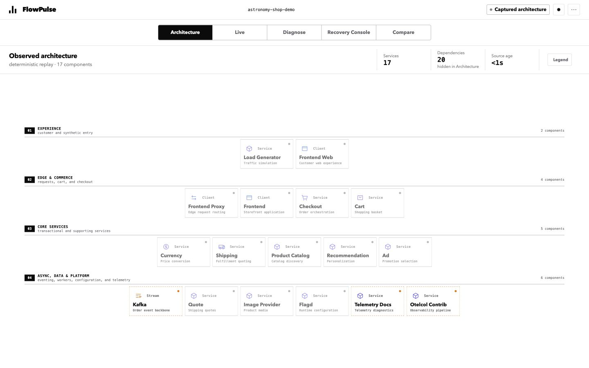
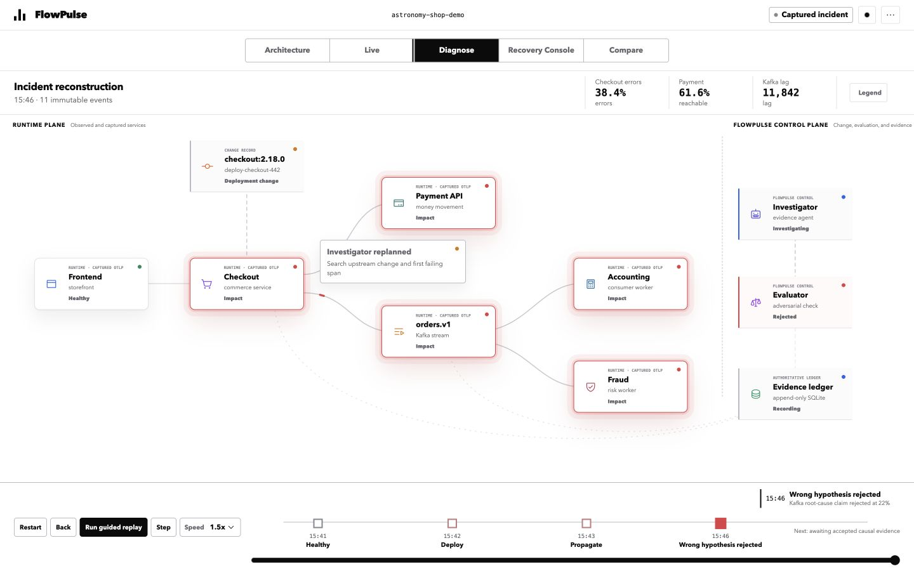
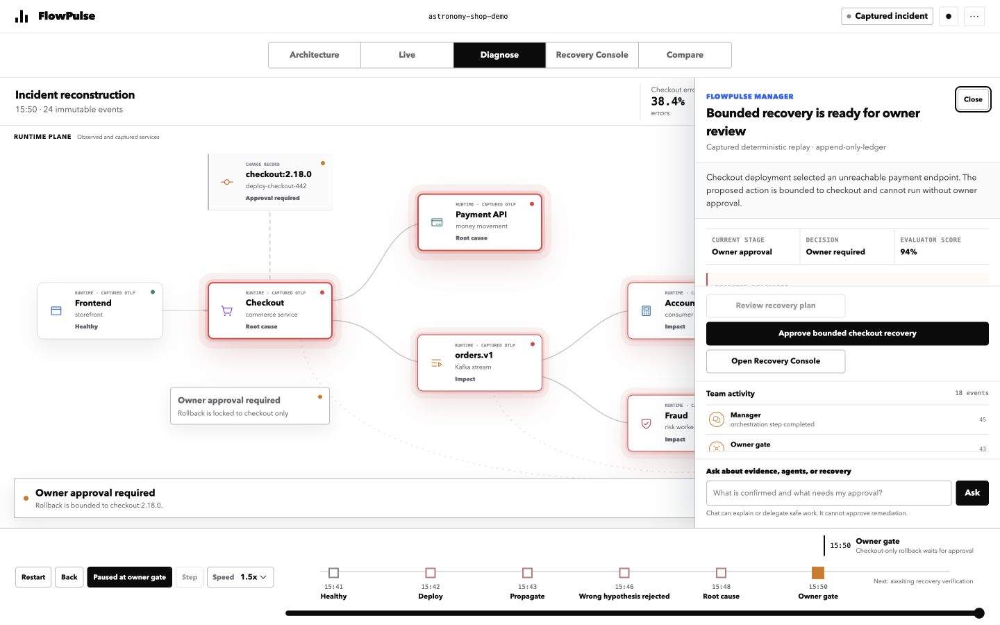
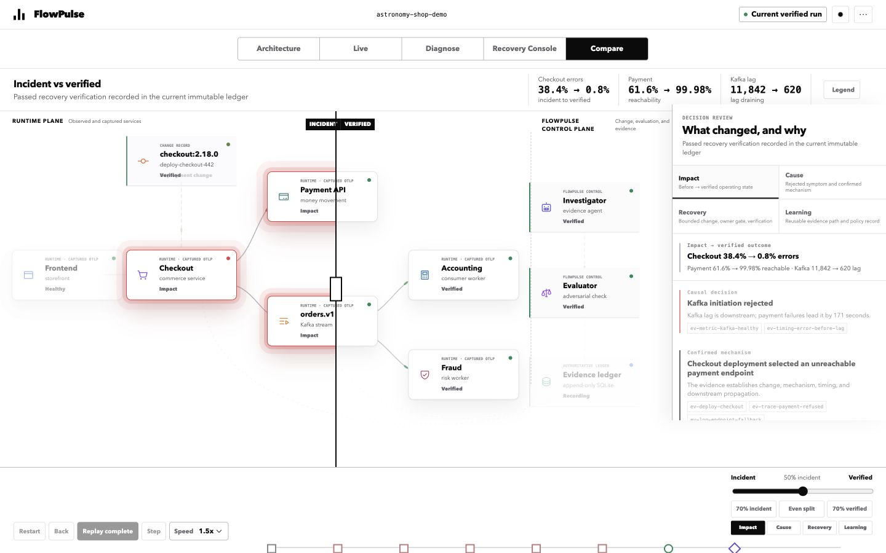

# FlowPulse — Evidence-grounded incident recovery

## Tagline

Turn fragmented production signals into a challengeable, owner-gated recovery
loop that learns from every incident.

## Short description

FlowPulse is an Incident Digital Twin for engineering teams. It joins
telemetry, versioned change evidence, adversarial evaluation, bounded
remediation, recovery verification, and regression learning in one immutable
ledger-backed workflow.

## The problem

During a production incident, teams do not lack dashboards; they lack a
defensible path from a symptom to a safe decision. A plausible AI explanation
can confidently blame Kafka while payment failures and a checkout change are
the actual causal chain. Operators still need to inspect evidence, keep repair
scope small, and know when a human must decide.

## The solution

FlowPulse makes the investigation itself inspectable. Its shared system canvas
can show Architecture, Live, Diagnose, Recovery Console, and Compare views
without changing the identity of the underlying components. The append-only
ledger is runtime authority. Every hypothesis and evaluator response is tied
to evidence IDs; remediation is a checked-in allowlist and cannot execute
without an immutable owner approval.

In the flagship Astronomy Shop incident, a versioned checkout change makes
payment unreachable. Retry amplification contributes to Kafka lag and delays
accounting and fraud. The investigator initially blames Kafka. An adversarial
evaluator rejects the unsupported diagnosis, forcing an evidence replan across
change, trace, log, metric, and deploy evidence. Only then can FlowPulse offer
a checkout-only recovery, verify fresh recovery evidence, and create a
regression record.

## How it works

1. A bounded evidence source provides deterministic captured replay or a
   frozen, hashed local OTLP snapshot.
2. The investigator obtains evidence through fixed tools. The evaluator checks
   causal coverage and can reject the claim once before replan.
3. Code validates known evidence IDs, temporal ordering, and the exact
   change-to-failure mechanism before an executable-looking proposal exists.
4. An owner alone grants approval. The local development adapter can execute
   one exact checkout repair command; it cannot accept a free-form model
   command.
5. Verification requires evidence newer than repair execution. A regression
   capture and deterministic policy evaluation record what the team learned.

## Built with GPT-5.6 and Codex

Codex was the primary engineering environment for the product contract,
ledger-backed runtime, evidence safety controls, Incident Digital Twin UI,
tests, documentation, and browser QA.

In credentialed mode, GPT-5.6 uses the OpenAI Responses API with strict
function schemas, bounded tool rounds, structured outputs, `store: false`, and
an independent adversarial evaluator. It queries only a frozen,
provenance-preserving OTLP snapshot, never an unbounded live stream. The
checked-in deterministic replay remains the credential-free judge path.

## Safety and authority

- The SQLite ledger rejects updates and deletes; it is the source of runtime
  truth.
- Raw OTLP payloads never enter browser/model APIs. Safe projections redact
  secrets, identifiers, URL query data, emails, and long IDs.
- A diagnosis must cite the exact applied change and a post-change
  checkout-to-payment network failure in temporal order before repair can be
  proposed.
- Repair is limited to `repair-payment-reachable-v1`, target `checkout`, and
  command `astronomy.restore-payment-and-recreate-checkout`.
- Langfuse is an optional observability mirror, never an authority or gate.

## Real-runtime proof, replay, and model claims

The default judge experience is deterministic replay from the checked-in,
captured Astronomy Shop incident bundle. It requires Node.js 20+ and sqlite3;
it does not need Docker, an OpenAI key, or Langfuse credentials.

Separately, the team completed a disposable local OpenTelemetry Astronomy Shop
proof at pinned upstream revision `18b36c73ccc2dbc86759dab2e0ef05175a7a8ca5`:
real `change.applied` → frozen OTLP snapshot → rejected false attribution →
accepted causal diagnosis → owner approval → allowlisted checkout rollback →
fresh verification → regression/policy events. The exact hashes, evidence IDs,
event ordering, and process/port details are recorded in the
[runtime QA record](../qa/2026-07-18-competition-backend-hardening-qa.md).

One bounded GPT-5.6 run over a frozen real snapshot correctly returned
`insufficient_evidence` because it could not prove direct flag consumption or
propagation. It created no repair proposal, approval request, or execution.
Langfuse was not configured in that proof, so no trace link, cost, or latency
claim is made.

## Challenges, accomplishments, and learnings

The hard part was not generating an incident summary—it was making unsafe
explanations unable to advance. We learned to keep causal predicates narrowly
mechanistic, preserve the selected signal's own timestamp, reserve essential
causal records under snapshot caps, and treat evidence redaction as a semantic
projection rather than simple truncation.

The result is a compact Developer Tools workflow where the false diagnosis is
part of the product's learning signal instead of a hidden failure.

## What's next

We would add authenticated deployment controls and more evidence adapters only
after preserving the same frozen-snapshot, causal-gate, owner-approval, and
verified-recovery contract. FlowPulse does not claim generic autonomous
production remediation today.

## Tech stack

Node.js 20, SQLite, OpenTelemetry JSONL, OpenAI Responses API / GPT-5.6,
Langfuse OpenTelemetry mirror (optional), dependency-free HTML/CSS/JS Incident
Digital Twin, Docker for the isolated local Astronomy Shop proof.

## Links to complete before submission

- Repository: local repository / public URL pending owner action
- Hosted demo: pending owner action
- Public video: pending owner action
- Required `/feedback` Session ID: pending generation and confirmation
